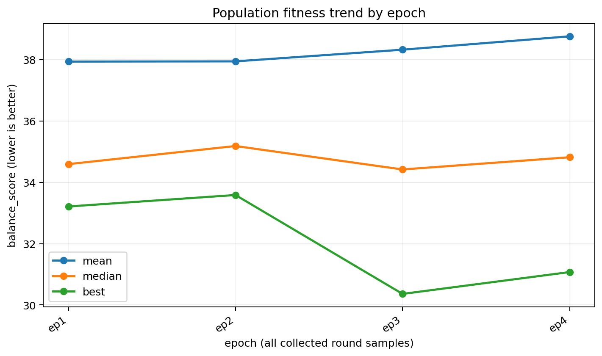
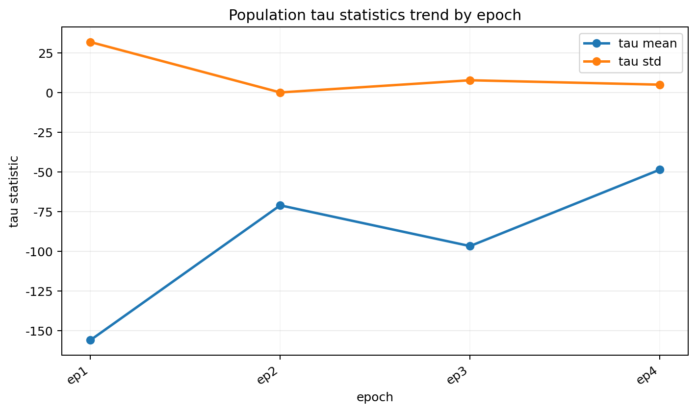
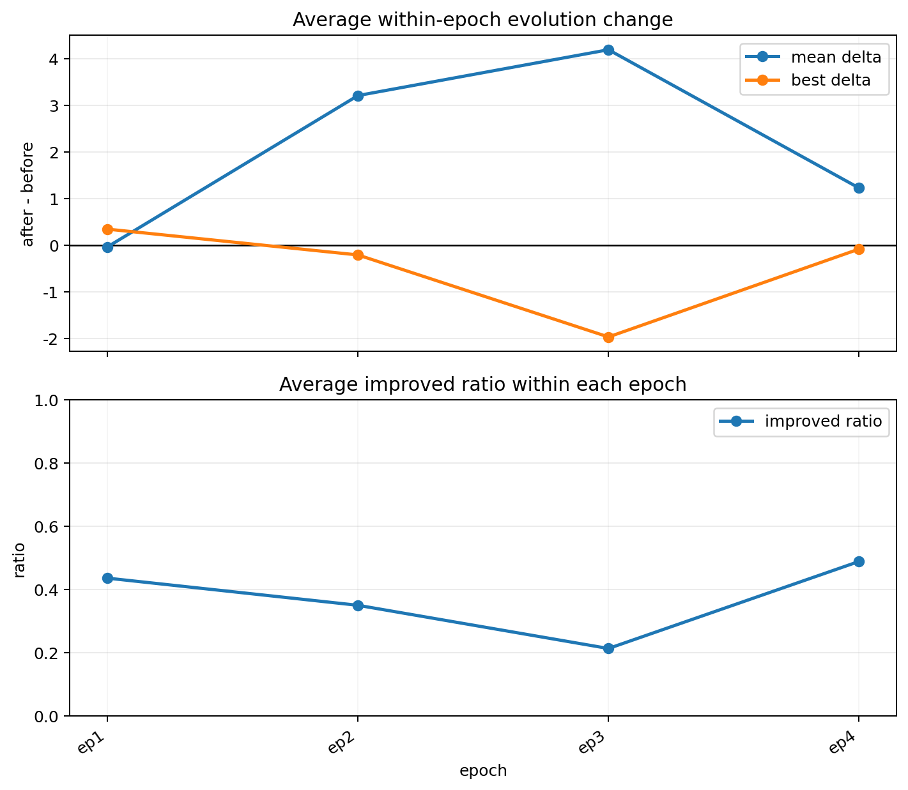

历史
====

.. mermaid::

   graph TD
      base["基础框架"]
      problem["问题发现"]
      proxy["当前方案"]
      diagnose["当前诊断"]
      next["后续改进方向"]

      rank["排序学习"]
      multi["多目标拆分预测"]
      sample["样本优化"]
      separate["单独验证"]

      base --> problem
      problem --> proxy
      proxy --> diagnose
      diagnose --> next
      next --> rank
      next --> multi
      next --> sample
      next --> separate

图中节点说明：

.. code-block:: text

   基础框架：DQN + SUMO + 条件扩散模型 + Pareto 平衡选择
   问题发现：原始 -MSE 不能作为仿真后的真实似然
   当前方案：代理模型预测真实 SUMO 后的 balance_score
   当前诊断：MAE 接近标签标准差，Spearman 接近 0
   后续改进方向：排序学习、多目标拆分预测、样本优化、单独验证

2026-06-13：清理原始后验设计
----------------------------

主要内容：

.. code-block:: text

   移除旧的 -MSE 后验逻辑
   明确似然应来自真实 SUMO 评价或代理模型对真实评价的估计
   保留扩散模型作为候选样本先验

当前理解：

.. code-block:: text

   先验：扩散模型生成候选 reward 序列
   真实评价：SUMO 仿真得到 balance_score
   代理似然：代理模型预测真实 balance_score
   后验筛选：根据 proxy_score 选择下一代候选

2026-06-17：加入代理模型诊断
----------------------------

主要内容：

.. code-block:: text

   增加代理模型训练样本保存
   增加代理模型训练指标记录
   增加代理模型质量检测脚本
   增加后验效果检测脚本

代理模型当前结果：

.. code-block:: text

   代理模型训练样本记录数：3072
   最后一次训练样本数：512
   最后一次验证样本数：128
   验证 MAE：8.7898
   真实标签标准差：8.8851
   MAE / 标签标准差：0.9893
   预测值与真实值 Spearman 相关：0.0508
   proxy_score 与真实值 Spearman 相关：-0.0424

当前判断：

.. code-block:: text

   代理模型已经完成训练流程，但预测误差较大，排序相关性较弱。
   当前代理模型还不能稳定支撑后验筛选。

2026-06-17：后验筛选效果评估
----------------------------

主要内容：

.. code-block:: text

   检查代理后验筛选后的真实 SUMO 表现是否变好
   对比筛选前后 balance_score 的 mean 和 best
   检查代理预测排序与真实排序是否一致

当前结果：

.. code-block:: text

   可评估后验轮数：22
   平均表现变好的轮数：11 / 22
   最优样本变好的轮数：7 / 22
   平均表现变差的轮数：11 / 22

当前判断：

.. code-block:: text

   后验流程已经跑通，但效果不稳定。
   当前问题更可能来自代理模型预测和排序能力不足。
   也需要进一步检查扩散模型候选池本身是否包含足够好的样本。

2026-06-25：整体种群生成趋势评估
--------------------------------

本次实验目的：

.. code-block:: text

   本次实验关注训练过程中生成种群的整体质量变化。
   因此不把单个样本或单个 round 作为主要结论，而是按 epoch 汇总种群质量。
   评价指标仍然使用真实 SUMO 仿真后的 balance_score，数值越低表示效果越好。

整体 fitness 趋势：

.. code-block:: text

   mean：当前 epoch 内所有生成样本 balance_score 的平均值。
   median：当前 epoch 内所有生成样本 balance_score 的中位数。
   best：当前 epoch 内 balance_score 最小的样本，即该 epoch 的最优个体。

   由于 balance_score 越低越好：
   mean 下降表示整体种群平均质量变好；
   median 下降表示大多数样本的质量变好；
   best 下降表示当前 epoch 能生成更优的单个个体。

实验结果：

.. code-block:: text

   epoch 1：mean = 37.9372，median = 34.5929，best = 33.2110
   epoch 2：mean = 37.9439，median = 35.1833，best = 33.5855
   epoch 3：mean = 38.3249，median = 34.4186，best = 30.3600
   epoch 4：mean = 38.7608，median = 34.8174，best = 31.0725

趋势判断：

.. code-block:: text

   mean 从 37.94 缓慢上升到 38.76，没有下降趋势。
   这说明整体种群平均质量没有变好，反而略微变差。

   median 在 34.4 到 35.2 附近上下波动，没有持续下降。
   这说明大多数样本的质量没有稳定改善。

   best 在 epoch 3 明显下降到 30.36，说明模型可以偶尔生成更优个体。
   但 epoch 4 又回升到 31.07，说明最优个体的改善还不稳定。

   因此当前实验只能说明模型有时能够生成更好的单个样本，
   但还不能证明整个种群生成质量随着训练稳定提升。

tau 分布变化：

.. code-block:: text

   tau 是扩散模型生成的 reward 序列。
   tau_mean 表示当前 epoch 生成 reward 序列的整体平均值。
   tau_std 表示当前 epoch 生成 reward 序列的离散程度。

   代码中的 reward = -queue，因此 reward 越大表示排队惩罚越小。
   tau_mean 上升说明扩散模型生成的 reward 序列整体往更大的奖励值方向移动。
   tau_std 下降说明生成 reward 的波动范围变小，样本分布更集中。

当前观察：

.. code-block:: text

   tau_mean 整体从较低位置向上移动，说明扩散模型生成的 reward 序列确实在往奖励值更大的方向变化。
   结合 reward = -queue，这个方向从定义上看更接近低排队惩罚。

   tau_std 相比初始 epoch 明显下降，说明生成 reward 的分布变得更集中。
   这代表模型生成的样本不再像初始阶段那样分散，探索范围有所收缩。

   但是 tau_mean 上升和 tau_std 下降没有稳定带来 balance_score 的下降。
   因此当前问题不是扩散模型没有变化，而是 reward 分布变化还没有稳定转化成真实 SUMO 效果提升。

epoch 内部进化变化：

.. code-block:: text

   mean delta = 进化后 mean balance_score - 进化前 mean balance_score。
   best delta = 进化后 best balance_score - 进化前 best balance_score。
   improved ratio = 进化后 balance_score 下降的样本比例。

   由于 balance_score 越低越好：
   delta < 0 表示变好；
   delta > 0 表示变差；
   improved ratio 越高，说明变好的样本比例越大。

当前观察：

.. code-block:: text

   mean delta 大部分位于 0 以上，说明内部进化后平均 balance_score 经常升高。
   这代表平均种群质量在进化后没有稳定变好，部分 epoch 反而变差。

   best delta 在 epoch 2 和 epoch 3 为负，说明最优个体在这些 epoch 中确实被进一步改进。
   但是 best delta 不是每个 epoch 都为负，因此最优样本的改进也不稳定。

   improved ratio 没有稳定超过 0.5，说明超过一半样本变好的情况并不稳定。
   这进一步说明当前进化过程更像是偶尔找到好个体，而不是稳定推动整个种群变好。

本次结论：

.. code-block:: text

   当前框架已经可以记录并展示 epoch 级别的种群变化。
   从现有结果看，扩散模型生成分布在变化，也能偶尔产生更优个体。
   但是整体种群质量没有随 epoch 稳定提升。

   下一步重点不是继续增加很多新模块，
   而是围绕当前结果中最明显的两个问题进行改进：
   1. 整体 mean 没有下降；
   2. best 偶尔变好，但没有带动整个种群一起变好。

后续计划
--------

.. mermaid::

   graph TD
      trend["当前现象：best 偶尔变好，但 mean 没有稳定下降"]
      mean_plan["改进一：让整体种群 mean 下降"]
      best_plan["改进二：围绕优秀个体进行局部扩展"]
      verify["真实 SUMO 验证 epoch 趋势"]

      trend --> mean_plan
      trend --> best_plan
      mean_plan --> verify
      best_plan --> verify

改进方向说明：

.. code-block:: text

   1. 让整体种群 mean 下降
      这次实验中，best 曾经变好，但 mean 没有下降，说明问题不在于完全找不到好样本，
      而在于大部分生成样本仍然没有被推向更好的区域。

      因此后续要把评价重点从“有没有一个最优样本”改成“整批样本的平均质量有没有提升”。
      具体做法是继续用真实 SUMO 的 balance_score 统计每个 epoch 的 mean、median、best 和 std。
      如果修改后只有 best 下降，而 mean 和 median 不下降，就说明改进仍然只是偶然找到好个体；
      只有 mean 或 median 也开始下降，才能说明生成种群整体质量真的在提高。

      这样改的原因是：最终训练需要的是一批稳定可用的候选种群，
      不是只依赖某一次随机生成出来的单个好样本。

   2. 围绕优秀个体进行局部扩展
      epoch 3 中 best 下降到 30.36，说明当前扩散模型生成空间里确实存在更好的个体。
      但是这个好个体没有带动 mean 下降，说明优秀区域没有被稳定利用起来。

      因此后续可以把已经找到的优秀样本作为局部中心，
      在它附近继续生成或筛选更多候选样本，而不是每次都大范围随机探索。
      目标是让更多样本靠近优秀区域，使 best 的优势逐渐扩散到 median 和 mean。

      这样改的原因是：当前结果已经证明模型偶尔能找到好点，
      下一步更合理的是利用这些好点扩大优秀样本比例，而不是只继续盲目探索。

后续重点：

.. code-block:: text

   当前最关键的问题不是能不能生成一个好样本，
   而是能不能让整个生成种群的分布逐步向好样本区域移动。

   因此后续实验判断标准调整为：
   1. mean 是否随 epoch 下降；
   2. median 是否随 epoch 下降；
   3. best 是否稳定保持或继续下降；
   4. std 是否变小，说明种群不再大范围波动。

当前核心公式
------------

扩散先验：

.. math::

   x_i \sim p_\theta(x \mid c)

SUMO 真实评价：

.. math::

   y_i = \operatorname{SUMO}(x_i,c)

代理模型：

.. math::

   \hat{y}_i = f_\phi(x_i,c)

后验筛选分数：

.. math::

   s_i = -\mu_i + \gamma\sigma_i

下一代选择：

.. math::

   X_{next} = \operatorname{TopK}(s_i)

当前需要解决的问题是让 :math:`s_i` 对真实 SUMO 表现具有稳定排序能力。
