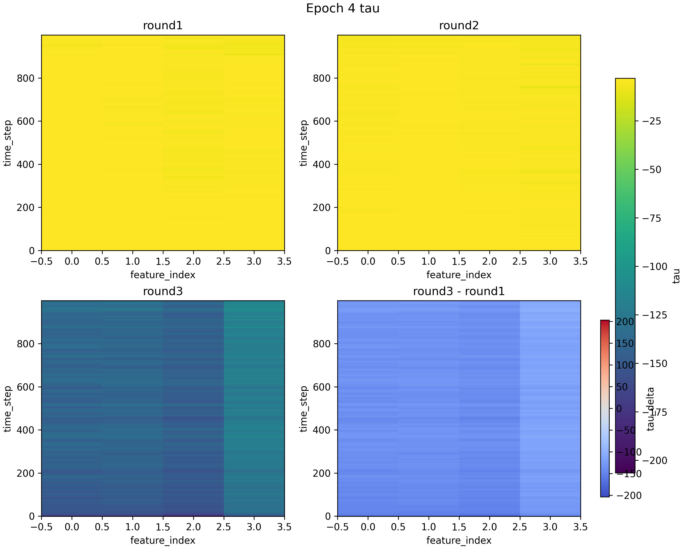
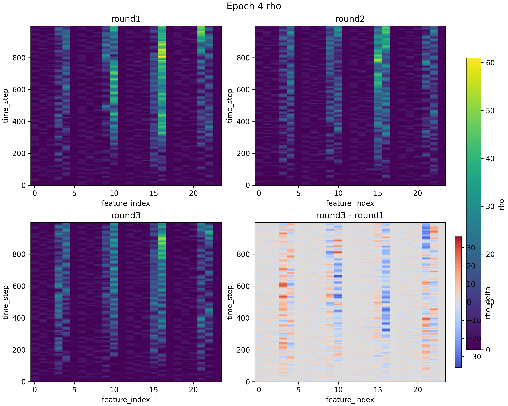

历史
====

.. mermaid::

   graph TD
      base["基础框架"]
      problem["问题发现"]
      proxy["当前方案"]
      diagnose["当前诊断"]
      next["后续改进方向"]

      rank["排序学习"]
      multi["多目标拆分预测"]
      sample["样本优化"]
      separate["单独验证"]

      base --> problem
      problem --> proxy
      proxy --> diagnose
      diagnose --> next
      next --> rank
      next --> multi
      next --> sample
      next --> separate

图中节点说明：

.. code-block:: text

   基础框架：DQN + SUMO + 条件扩散模型 + Pareto 平衡选择
   问题发现：原始 -MSE 不能作为仿真后的真实似然
   当前方案：代理模型预测真实 SUMO 后的 balance_score
   当前诊断：MAE 接近标签标准差，Spearman 接近 0
   后续改进方向：排序学习、多目标拆分预测、样本优化、单独验证

2026-06-13：清理原始后验设计
----------------------------

主要内容：

.. code-block:: text

   移除旧的 -MSE 后验逻辑
   明确似然应来自真实 SUMO 评价或代理模型对真实评价的估计
   保留扩散模型作为候选样本先验

当前理解：

.. code-block:: text

   先验：扩散模型生成候选 reward 序列
   真实评价：SUMO 仿真得到 balance_score
   代理似然：代理模型预测真实 balance_score
   后验筛选：根据 proxy_score 选择下一代候选

2026-06-17：加入代理模型诊断
----------------------------

主要内容：

.. code-block:: text

   增加代理模型训练样本保存
   增加代理模型训练指标记录
   增加代理模型质量检测脚本
   增加后验效果检测脚本

代理模型当前结果：

.. code-block:: text

   代理模型训练样本记录数：3072
   最后一次训练样本数：512
   最后一次验证样本数：128
   验证 MAE：8.7898
   真实标签标准差：8.8851
   MAE / 标签标准差：0.9893
   预测值与真实值 Spearman 相关：0.0508
   proxy_score 与真实值 Spearman 相关：-0.0424

当前判断：

.. code-block:: text

   代理模型已经完成训练流程，但预测误差较大，排序相关性较弱。
   当前代理模型还不能稳定支撑后验筛选。

2026-06-17：后验筛选效果评估
----------------------------

主要内容：

.. code-block:: text

   检查代理后验筛选后的真实 SUMO 表现是否变好
   对比筛选前后 balance_score 的 mean 和 best
   检查代理预测排序与真实排序是否一致

当前结果：

.. code-block:: text

   可评估后验轮数：22
   平均表现变好的轮数：11 / 22
   最优样本变好的轮数：7 / 22
   平均表现变差的轮数：11 / 22

当前判断：

.. code-block:: text

   后验流程已经跑通，但效果不稳定。
   当前问题更可能来自代理模型预测和排序能力不足。
   也需要进一步检查扩散模型候选池本身是否包含足够好的样本。

2026-06-25：整体种群生成趋势评估
--------------------------------

本次实验目的：

.. code-block:: text

   本次实验关注训练过程中生成种群的整体质量变化。
   因此不把单个样本或单个 round 作为主要结论，而是按 epoch 汇总种群质量。
   评价指标仍然使用真实 SUMO 仿真后的 balance_score，数值越低表示效果越好。

整体 fitness 趋势：

.. code-block:: text

   mean：当前 epoch 内所有生成样本 balance_score 的平均值。
   median：当前 epoch 内所有生成样本 balance_score 的中位数。
   best：当前 epoch 内 balance_score 最小的样本，即该 epoch 的最优个体。

   由于 balance_score 越低越好：
   mean 下降表示整体种群平均质量变好；
   median 下降表示大多数样本的质量变好；
   best 下降表示当前 epoch 能生成更优的单个个体。

.. image:: images/01_epoch_fitness_trend.png
   :alt: epoch 级种群 fitness 趋势
   :align: center
   :width: 90%

实验结果：

.. code-block:: text

   epoch 1：mean = 37.9372，median = 34.5929，best = 33.2110
   epoch 2：mean = 37.9439，median = 35.1833，best = 33.5855
   epoch 3：mean = 38.3249，median = 34.4186，best = 30.3600
   epoch 4：mean = 38.7608，median = 34.8174，best = 31.0725

趋势判断：

.. code-block:: text

   mean 从 37.94 缓慢上升到 38.76，没有下降趋势。
   这说明整体种群平均质量没有变好，反而略微变差。

   median 在 34.4 到 35.2 附近上下波动，没有持续下降。
   这说明大多数样本的质量没有稳定改善。

   best 在 epoch 3 明显下降到 30.36，说明模型可以偶尔生成更优个体。
   但 epoch 4 又回升到 31.07，说明最优个体的改善还不稳定。

   因此当前实验只能说明模型有时能够生成更好的单个样本，
   但还不能证明整个种群生成质量随着训练稳定提升。

tau 分布变化：

.. code-block:: text

   tau 是扩散模型生成的 reward 序列。
   tau_mean 表示当前 epoch 生成 reward 序列的整体平均值。
   tau_std 表示当前 epoch 生成 reward 序列的离散程度。

   代码中的 reward = -queue，因此 reward 越大表示排队惩罚越小。
   tau_mean 上升说明扩散模型生成的 reward 序列整体往更大的奖励值方向移动。
   tau_std 下降说明生成 reward 的波动范围变小，样本分布更集中。

.. image:: images/03_epoch_tau_stats.png
   :alt: epoch 级 tau 统计趋势
   :align: center
   :width: 90%

当前观察：

.. code-block:: text

   tau_mean 整体从较低位置向上移动，说明扩散模型生成的 reward 序列确实在往奖励值更大的方向变化。
   结合 reward = -queue，这个方向从定义上看更接近低排队惩罚。

   tau_std 相比初始 epoch 明显下降，说明生成 reward 的分布变得更集中。
   这代表模型生成的样本不再像初始阶段那样分散，探索范围有所收缩。

   但是 tau_mean 上升和 tau_std 下降没有稳定带来 balance_score 的下降。
   因此当前问题不是扩散模型没有变化，而是 reward 分布变化还没有稳定转化成真实 SUMO 效果提升。

epoch 内部进化变化：

.. code-block:: text

   mean delta = 进化后 mean balance_score - 进化前 mean balance_score。
   best delta = 进化后 best balance_score - 进化前 best balance_score。
   improved ratio = 进化后 balance_score 下降的样本比例。

   由于 balance_score 越低越好：
   delta < 0 表示变好；
   delta > 0 表示变差；
   improved ratio 越高，说明变好的样本比例越大。

.. image:: images/04_epoch_evolution_change.png
   :alt: epoch 内部进化变化
   :align: center
   :width: 90%

当前观察：

.. code-block:: text

   mean delta 大部分位于 0 以上，说明内部进化后平均 balance_score 经常升高。
   这代表平均种群质量在进化后没有稳定变好，部分 epoch 反而变差。

   best delta 在 epoch 2 和 epoch 3 为负，说明最优个体在这些 epoch 中确实被进一步改进。
   但是 best delta 不是每个 epoch 都为负，因此最优样本的改进也不稳定。

   improved ratio 没有稳定超过 0.5，说明超过一半样本变好的情况并不稳定。
   这进一步说明当前进化过程更像是偶尔找到好个体，而不是稳定推动整个种群变好。

高维样本结构可视化：

.. code-block:: text

   前面的折线图主要观察整体结果，例如 mean、median、best 和 delta。
   这些图可以反映一批样本整体有没有变好，
   但是不能直接展示样本内部哪些位置发生了变化。

   因此这里把每轮保存下来的 tau 和 rho 画成热力图。
   图中的前三个子图分别表示 round1、round2、round3。
   右下角是 round3 - round1，用来观察三轮之后哪些位置增大，哪些位置减小。

tau 高维结构：

.. code-block:: text

   tau 表示扩散模型生成的 reward 序列。
   原始 tau 是 sample_count × time_step × direction。
   因为一个 round 中包含多个样本，
   所以这里先对 sample_count 求平均，
   这样就能得到一张 time_step × direction 的图。

   横轴是 direction_index，对应 reward 序列中的不同方向或动作维度。
   纵轴是 time_step，对应时间步。
   颜色表示这个位置上的 tau 平均值。

tau 图观察：

.. code-block:: text

   从图上看，round1、round2、round3 的颜色分布并不完全相同。
   这说明扩散模型每一轮生成出来的 tau 存在变化，
   不是三轮都在生成完全相同的 reward 序列。

   右下角的差值图里有红色也有蓝色。
   红色表示 round3 这个位置的 tau 比 round1 更大；
   蓝色表示 round3 这个位置的 tau 比 round1 更小。

   因此目前可以看到，tau 并不是只发生整体平移，
   而是在不同 time_step 和 direction 上都有一些局部变化。
   不过这个图只能说明 tau 本身发生了变化，
   还不能直接说明这些变化一定能让 SUMO 结果变好，
   这个还要和真实仿真后的 balance_score 放在一起看。

rho 高维结构：

.. code-block:: text

   rho 表示状态-动作条件信息。
   当前 rho 的形状为 time_step × feature_index。

   横轴是 feature_index，对应状态-动作条件里的不同特征。
   纵轴是 time_step。
   颜色表示这个时间步下某个特征的 rho 数值。

rho 图观察：

.. code-block:: text

   rho 这张图和 tau 不太一样。
   它的横轴只有 24 个特征，所以图上会出现比较明显的竖向特征带。
   这些特征带说明 rho 的变化主要集中在部分 feature 上，
   并不是所有 feature 都有相同程度的变化。

   从 round1、round2、round3 看，主要高值区域大体集中在相近的 feature 上。
   这说明 rho 的主要结构保持相对稳定。

   但是右下角的差值图里也能看到一些红色和蓝色区域，
   说明部分 feature 在某些时间步上仍然发生了变化。

   所以这张图主要说明：
   rho 的整体结构比较稳定；
   但不同轮次之间并不是完全不变，局部特征仍然有调整。

本次结论：

.. code-block:: text

   当前框架已经可以记录并展示 epoch 级别的种群变化。
   从现有结果看，扩散模型生成分布在变化，也能偶尔产生更优个体。
   但是整体种群质量没有随 epoch 稳定提升。

   下一步重点不是继续增加很多新模块，
   而是围绕当前结果中最明显的两个问题进行改进：
   1. 整体 mean 没有下降；
   2. best 偶尔变好，但没有带动整个种群一起变好。

后续计划
--------

.. mermaid::

   graph TD
      trend["当前现象：best 偶尔变好，但 mean 没有稳定下降"]
      mean_plan["改进一：让整体种群 mean 下降"]
      best_plan["改进二：围绕优秀个体进行局部扩展"]
      verify["真实 SUMO 验证 epoch 趋势"]

      trend --> mean_plan
      trend --> best_plan
      mean_plan --> verify
      best_plan --> verify

改进方向说明：

.. code-block:: text

   1. 让整体种群 mean 下降
      这次实验中，best 曾经变好，但 mean 没有下降，说明问题不在于完全找不到好样本，
      而在于大部分生成样本仍然没有被推向更好的区域。

      因此后续要把评价重点从“有没有一个最优样本”改成“整批样本的平均质量有没有提升”。
      具体做法是继续用真实 SUMO 的 balance_score 统计每个 epoch 的 mean、median、best 和 std。
      如果修改后只有 best 下降，而 mean 和 median 不下降，就说明改进仍然只是偶然找到好个体；
      只有 mean 或 median 也开始下降，才能说明生成种群整体质量真的在提高。

      这样改的原因是：最终训练需要的是一批稳定可用的候选种群，
      不是只依赖某一次随机生成出来的单个好样本。

   2. 围绕优秀个体进行局部扩展
      epoch 3 中 best 下降到 30.36，说明当前扩散模型生成空间里确实存在更好的个体。
      但是这个好个体没有带动 mean 下降，说明优秀区域没有被稳定利用起来。

      因此后续可以把已经找到的优秀样本作为局部中心，
      在它附近继续生成或筛选更多候选样本，而不是每次都大范围随机探索。
      目标是让更多样本靠近优秀区域，使 best 的优势逐渐扩散到 median 和 mean。

      这样改的原因是：当前结果已经证明模型偶尔能找到好点，
      下一步更合理的是利用这些好点扩大优秀样本比例，而不是只继续盲目探索。

后续重点：

.. code-block:: text

   当前最关键的问题不是能不能生成一个好样本，
   而是能不能让整个生成种群的分布逐步向好样本区域移动。

   因此后续实验判断标准调整为：
   1. mean 是否随 epoch 下降；
   2. median 是否随 epoch 下降；
   3. best 是否稳定保持或继续下降；
   4. std 是否变小，说明种群不再大范围波动。

当前核心公式
------------

扩散先验：

.. math::

   x_i \sim p_\theta(x \mid c)

SUMO 真实评价：

.. math::

   y_i = \operatorname{SUMO}(x_i,c)

代理模型：

.. math::

   \hat{y}_i = f_\phi(x_i,c)

后验筛选分数：

.. math::

   s_i = -\mu_i + \gamma\sigma_i

下一代选择：

.. math::

   X_{next} = \operatorname{TopK}(s_i)

当前需要解决的问题是让 :math:`s_i` 对真实 SUMO 表现具有稳定排序能力。

2026-07-03：进化停滞原因诊断
----------------------------

想回答的问题：

.. code-block:: text

   有时候能出一个更好的样本，但整个种群就是没有一直往好了走。
   这到底是扩散模型的问题，还是代理模型的问题，还是继承机制的问题？

所以我看了下面的四个采样数据并进行了分析：

.. code-block:: text

   1. iteration_stats.csv
      整体种群最后有没有变好？

   2. proxy_surrogate_metrics.csv
      代理模型本身训练得怎么样？

   3. proxy_candidate_selection_*.csv
      代理筛选时有没有真的把候选区分开？

   4. sample_eval_proxy_posterior_*.csv
      被筛出来的样本，真实跑 SUMO 后到底有没有更好？

怎么判断真实后验结果：

.. code-block:: text

   best delta = 最后一代 best balance_score - 第一代 best balance_score
   mean delta = 最后一代 mean balance_score - 第一代 mean balance_score

   balance_score 越低越好：
   delta < 0 说明变好了
   delta = 0 说明基本没动
   delta > 0 说明变差了

.. list-table:: 真实 SUMO 后验结果（epochs 17-19，round 1-3）
   :header-rows: 1

   * - epoch-round
     - best delta
     - mean delta
     - 现象
   * - 17-1
     - 0.0000
     - 0.0000
     - 完全停住
   * - 17-2
     - 0.0000
     - 0.0000
     - 完全停住
   * - 17-3
     - 0.0000
     - -0.0020
     - 只有整体均值轻微变好
   * - 18-1
     - 0.0000
     - +0.2021
     - 最优没变，整体均值变差
   * - 18-2
     - +0.7012
     - -4.4013
     - 整体回缩了，但原本最优个体没有保住
   * - 18-3
     - 0.0000
     - -0.1890
     - 均值略有改善，但最好样本没继续下降
   * - 19-1
     - -0.1657
     - +0.5515
     - 最优个体变好，但整体种群反而变差
   * - 19-2
     - 0.0000
     - 0.0000
     - 完全停住
   * - 19-3
     - 0.0000
     - 0.0000
     - 完全停住

把上面这些整理一下：

.. list-table::
   :header-rows: 1

   * - 指标
     - 数值
     - 说明
   * - 可分析 round 数
     - 9
     - 只统计真正进了进化流程的 round 1-3
   * - best 和 mean 同时变好
     - 0 / 9
     - 没有一次同时带动最优值和整体均值下降
   * - 只有 best 变好
     - 1 / 9
     - 典型是 19-1
   * - 只有 mean 变好
     - 3 / 9
     - 更像是整体回缩，不是稳定保住最好个体
   * - 两者都没变好
     - 5 / 9
     - 经常等于没动或者原地波动

从这些数据来看：

.. code-block:: text

   19-1 里 best 确实下降过，说明系统偶尔能碰到更好的点。
   但好样本出来一次之后，下一轮大部分又回去了，没有带着整批一起变好。

代理筛选为什么没把候选样本拉开：

.. code-block:: text

   每次代理筛选时，先随机生成 192 个候选样本，
   然后根据 predicted_balance_score 和 proxy_score 选出 95 个，
   加上 1 个真实 elite，组成下一代 96 个样本。

.. list-table:: 代理筛选分数离散度（epochs 17-19，round 1-3）
   :header-rows: 1

   * - 指标
     - 数值
     - 说明
   * - 代理筛选文件数
     - 83
     - 一共看了 83 次 posterior candidate selection
   * - predicted span < 1e-3
     - 74 / 83
     - 大多数轮次里，192 个候选分数几乎一样
   * - predicted span = 0
     - 30 / 83
     - 代理直接给所有候选打了一模一样的分数
   * - target_std < 1e-3
     - 21 / 83
     - 训练代理时，真实标签本身波动就很小
   * - 每次保留的真实 elite
     - 1
     - 剩下 95 个主要靠代理筛选

.. list-table:: 各 round 的代理预测离散程度
   :header-rows: 1

   * - epoch-round
     - 平均 predicted span
     - 现象
   * - 17-1
     - 0.000000
     - 完全常数打分
   * - 17-2
     - 0.000025
     - 几乎常数打分
   * - 17-3
     - 0.000001
     - 几乎常数打分
   * - 18-1
     - 0.000053
     - 几乎常数打分
   * - 18-2
     - 0.092432
     - 少数能真正拉开差距的轮次
   * - 18-3
     - 0.000025
     - 几乎常数打分
   * - 19-1
     - 0.000200
     - 仍然很小，区分度很弱
   * - 19-2
     - 0.000000
     - 完全常数打分
   * - 19-3
     - 0.000001
     - 几乎常数打分

从上面数据看：

.. code-block:: text

   代理模型在很多轮次里基本选不出来，192 个候选分数差不多，硬选了 95 个。
   不是"有一点误差"的程度，是大部分情况下代理根本没起筛选作用。

看代码能发现几个原因：

1. 真实 elite 继承太弱

   - 现在的做法是：每次从扩散模型重新生成一整池候选，再从里面筛下一代。
   - 实际上每轮只把 1 个真实 elite 强行放回去，另外 95 个都是重新筛的。
   - 所以好样本的记忆很弱，某一代偶尔变出一个好点，下一代大部分样本又回去了。

2. fine-tune 被重置了

   - 回合内每次迭代都会调 diffusion model 的 fine-tune。
   - 但是 train_diffusion_model 开头会重新加载 BEST_DDP_MODEL_PATH。
   - 这样看起来是连续微调，实际每次从同一个起点重新学，之前的改进没有积累下来。

3. elite 选择目标和最终评价目标不太一样

   - 当前代码里，current_best_sample 是按 q 或者 Pareto 平衡挑的。
   - 但后面真实仿真真正关心的是 balance_score。
   - 这两个目标不完全一样，所以可能出现：
     某个样本在 Pareto 平衡上被认为是当前最好的，
     但它不一定就是 balance_score 最低的那个。
   - 这也会让优秀个体的继承更难稳住。

4. reward 离散化有风险

   - traffic_simulator.py 里，reward 在几处直接转成了 int。
   - 如果不同样本的差异主要体现在小数部分，
     那这些差异在后面学习和回填的时候就被抹掉了。

为什么我觉得问题主要在继承机制，不只是扩散模型的问题：

.. code-block:: text

   这次数据里能看出两件事。

   第一，扩散模型不是完全没变化，前面的 tau 统计和热力图都能看出来。
   第二，系统不是完全找不到好样本，19-1 里 best 确实下降过。

   所以更像是：好样本偶尔出现一次，但没被保留住，也没吸引更多样本往它那边靠。
   问题不是找不到好点，是好点出现了但传不下去。

本次诊断的结论：

.. code-block:: text

   当前流程大致是：

   1. 扩散模型重新抽一大池候选；
   2. 代理模型在很多轮次里打不出差别；
   3. 只保留 1 个真实 elite；
   4. 下一代大部分样本又是重新来的。

   所以 best 偶尔能降一点，但 mean 很难持续下降。
   整体就是"有时能出一个好样本，但种群整体没有稳定变好"。

已经改了对应的代码，正在跑实验，等结果出来再看看。

.. list-table::
   :header-rows: 1

   * - 改了什么
     - 具体内容
   * - 多 elite 继承
     - 用多个真实 elite 做局部变异，不再只保留 1 个
   * - fine-tune 重置
     - 去掉每次从 BEST_DDP_MODEL_PATH 重新加载，让回合内微调可以累积
   * - reward 离散化
     - 去掉 reward 转 int 的操作，保持浮点精度

这次发现的问题：

.. code-block:: text

   不是没有优化信号，是好结果传不下去。

   下一步最要紧的不是加新模块，
   而是先把多 elite 继承、局部变异、连续微调这几个问题解决掉。

2026-07-06：0703 改动后的中途结果
----------------------------------

这次实验我还没有跑完，目前只到 epoch 1 的第二个 round、第 4 次进化。
所以我这里先不下最终结论，只看两个比较直接的问题：
0703 改的内容是不是真的用上了，以及真实 SUMO 指标有没有开始往好的方向动。

这里需要注意一下，输出文件里的 round 是从 0 开始数的。
所以这里说的第二个 round，在文件名里是 ``round1``。

这次我主要看了这些文件：

.. code-block:: text

   data/iteration_stats.csv
   data/proxy_surrogate_metrics.csv
   data/samples/sample_eval_ep1_round0.csv
   data/samples/sample_eval_ep1_round1.csv
   data/samples/proxy_candidate_selection_ep1_round0_iter*.csv
   data/samples/proxy_candidate_selection_ep1_round1_iter*.csv
   data/samples/sample_eval_proxy_posterior_ep1_round0_iter*.csv
   data/samples/sample_eval_proxy_posterior_ep1_round1_iter*.csv

我先看样本来源。
从 ``proxy_candidate_selection`` 文件可以看到，每次准备给代理模型筛选的样本里都有：

.. code-block:: text

   current_true_balance_elite：8
   diffusion_candidate：96
   elite_local_mutation：96

这说明我在 0703 加的两个改动确实跑起来了：
一是每轮不再只保留 1 个好样本，而是保留 8 个真实好样本；
二是会在这些好样本附近再生成一批局部变异样本。

round1 当前 4 次进化中，最后进入下一代的样本来源如下：

.. list-table::
   :header-rows: 1

   * - iter
     - 保留的真实好样本
     - 好样本附近的变异样本
     - 普通扩散样本
   * - 1
     - 8
     - 47
     - 41
   * - 2
     - 8
     - 0
     - 88
   * - 3
     - 8
     - 39
     - 49
   * - 4
     - 8
     - 14
     - 74

从这张表里看，我现在每次都能保住 8 个真实好样本。
这比之前只保留 1 个要稳一些，至少不会那么容易把已经找到的好样本丢掉。

不过，好样本附近生成的变异样本被选中的数量还不稳定。
iter1 选中了 47 个，iter2 一个都没有选中，iter4 又只选中 14 个。
这说明局部变异确实参与了进化，但代理模型还没有稳定地判断哪些局部变异更好。

然后我再看真实 SUMO 结果。
这里的 ``balance_score`` 越低越好。
round0 已经跑完 10 次进化，结果如下：

.. list-table::
   :header-rows: 1

   * - 指标
     - iter1
     - iter10
     - 变化
   * - balance mean
     - 37.6485
     - 36.4466
     - 下降 1.2019
   * - balance median
     - 34.5529
     - 34.5198
     - 略有下降
   * - balance best
     - 30.8308
     - 30.8308
     - 保持不变

round0 的平均值下降了，最好的样本没有继续变好，但也没有被丢掉。
这个结果让我觉得，目前至少能保住较好的样本，同时让整体平均表现稍微往回收。

round1 目前只跑到 iter4，结果如下：

.. list-table::
   :header-rows: 1

   * - 指标
     - iter1
     - iter4
     - 变化
   * - balance mean
     - 39.9893
     - 38.2247
     - 下降 1.7646
   * - balance median
     - 34.8044
     - 34.3925
     - 下降 0.4119
   * - balance best
     - 33.9550
     - 33.7563
     - 下降 0.1987
   * - balance std
     - 9.4545
     - 8.6426
     - 下降 0.8119

从 iter1 到 iter4 看，平均值、中位数、最优值和标准差都下降了。
这说明目前的方向是有一点改善的。
但是这个改善还不是一直往下走：
round1 iter3 的 mean 是 37.8459，iter4 又回到了 38.2247。
所以我现在只能说中途结果比之前更合理，还不能说已经稳定变好。

不过我觉得代理模型这边还是比较弱。
下面这个表里的差值，表示同一批候选样本中，代理模型给出的最高分和最低分差多少。
如果差值很小，就说明代理模型其实没有把候选样本明显区分开。

.. list-table::
   :header-rows: 1

   * - iter
     - predicted_balance_score 差值
     - proxy_score 差值
   * - 1
     - 0.000317
     - 0.000375
   * - 2
     - 0.000549
     - 0.000572
   * - 3
     - 0.000301
     - 0.000216
   * - 4
     - 0.001034
     - 0.001321

这些差值仍然很小。
也就是说，代理模型现在还不能很明显地区分哪个候选更好。
所以我认为目前看到的改善，更可能主要来自多保留了几个真实好样本，
以及在好样本附近做了局部变异，
而不是代理模型已经学会了稳定排序。

我目前的判断是：

.. code-block:: text

   0703 的改动确实已经用上了。
   真实好样本能稳定保留，局部变异样本也会参与下一代选择。

   真实 SUMO 指标有一点变好的迹象。
   round0 的平均值下降，最优样本被保住；
   round1 当前平均值、中位数、最优值和标准差也都比 iter1 更低。

   但代理模型本身还没有明显变强。
   它给不同候选样本打出的分数差距仍然很小。

所以我现在还不能说后验筛选已经稳定有效。
我觉得更合适的说法是：
0703 的改动缓解了“好样本传不下去”的问题，
中途结果也有一点往好的方向走，
但还需要等 round1 跑完，甚至继续看后面的 round。

后面我会继续重点看：

.. code-block:: text

   1. round1 跑完 10 次后，balance mean 能不能继续下降；
   2. best 能不能保住或者继续刷新；
   3. elite_local_mutation 被选中的数量会不会更稳定；
   4. 代理模型给候选样本打出的分数差距会不会变大；
   5. proxy_surrogate_metrics 中 target_std 是否还能保持正常波动。

2026-07-07：下一步实验方向
--------------------------

后面我准备补一个人为控制变异方向的实验。
这个实验我想看的不是再去调某个参数大一点还是小一点，
而是直接看变异出来的 reward 序列本身：
如果我手动把它往一个更像好样本的方向改，
真实 SUMO 结果会不会也跟着变好。

我一开始想到的是按时间分块来改。
因为当前 reward 序列是 ``1000 x 4`` 的时间序列，
不同时间段的交通状态不一样。
前期可能还没有堵起来，后期车辆积累以后 reward 往往会变差。
所以我最开始的想法是把 1000 个 time step 分成几个时间段，
分别比较好样本和差样本在每个时间段里的 reward 差异，
然后按这些差异去人为改 reward。

大致想法是：

.. code-block:: text

   1. 先用真实 SUMO 的 balance_score 选出好样本和差样本；
   2. 分别看每个时间段里，好样本和差样本的 reward 差在哪里；
   3. 把这个差异当成人为变异方向；
   4. 让普通样本沿这个方向变一下，再送回 SUMO 验证。

我觉得这个思路的优点是比较直观。
它不是随便加随机噪声，而是根据真实跑出来的好样本和差样本，
手动构造一个“从差样本往好样本靠”的方向。

但是后面我又想到一个问题：
reward 序列本身是连续变化的，如果按时间块硬切开，
每一段都用不同的改法，段和段之间可能会突然跳一下。
比如前 100 个时间步用一种方向，后 100 个时间步突然换成另一种方向，
这样 reward 曲线就可能不连续。

我觉得这个问题对当前任务可能会有影响。
因为后面 DQN 会把 reward 序列转成经验来学习。
如果人为制造了明显的时间跳变，
那最后 SUMO 结果变好或者变差，就不一定能说明变异方向本身有效，
也可能只是 reward 序列被改得不自然了。

所以后面我更倾向于不做硬分块，而是做一个整体连续的变异。
具体来说，还是先比较好样本和差样本，
但不是每个时间块单独换一个方向，
而是得到整条时间序列上的差异以后，再沿时间方向做平滑。
这样变异方向还是随时间变化的，但变化会比较连续。

可以写成：

.. code-block:: text

   raw_direction[t, d]
   =
   mean(good_tau[:, t, d]) - mean(bad_tau[:, t, d])

   smooth_direction[t, d]
   =
   temporal_smooth(raw_direction[t, d])

   tau_mut[t, d]
   =
   tau_parent[t, d] + alpha * w(t) * smooth_direction[t, d]

这里的 ``w(t)`` 可以理解成一个随时间慢慢变化的权重。
这样仍然能考虑前期和后期交通状态不一样，
但不会像硬分块那样在边界处突然改变 reward。

我目前对这两个想法的理解是：

.. code-block:: text

   分块变异比较容易解释不同时间段发生了什么，
   但可能让 reward 序列在时间上断开；

   连续变异不那么容易出现突变，
   更适合当前这种随时间变化的 reward_sequence。

所以我后续优先考虑连续的 good-bad 方向变异：

.. code-block:: text

   1. 当前种群真实跑 SUMO，得到 balance_score；
   2. 选出 balance_score 最低的一批样本作为好样本；
   3. 选出 balance_score 最高的一批样本作为差样本；
   4. 计算好样本和差样本在整条 reward 序列上的差异；
   5. 对这个差异沿时间方向做平滑，避免 reward 曲线突然断开；
   6. 用平滑后的方向生成手工变异样本；
   7. 再用 SUMO 看 balance_score 的平均值、中位数和最优值有没有下降。

为了确认这个方向不是碰巧有效，我还可以做一个反向对照：

.. code-block:: text

   正向：tau_pos = tau_parent + alpha * smooth_direction
   反向：tau_neg = tau_parent - alpha * smooth_direction

如果正向扰动后 ``balance_score`` 下降，而反向扰动后变差，
就能更清楚地说明这个手工构造的变异方向确实有用。

所以这一步我最想看清楚的是：
reward 序列的变异方向能不能被人为控制，
以及这种人为控制能不能真正反映到 SUMO 的交通指标上。
